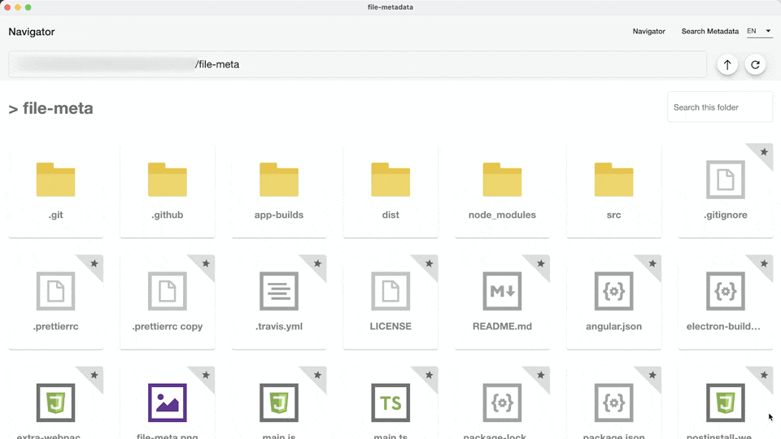

<div>
  <a href="https://angular.io/">
    
  </a>
  <a href="http://typeorm.io/">
    
  </a>
   <a href="https://electronjs.org/">
    
  </a>
  <br>
</div>

# file-metadata

## Quickstart

```bash
npm install
npm start
```

## Description

A simple cross platform file navigator that lets you add and search by arbitrary file metadata.

## Features

- Cross platform: macOS, Linux, Windows
- Rich text metadata
- Search by metadata
- Auto attach metadata to duplicate files
- No file modification
  - _All metadata is stored in a standalone SQLite database._
- i18n

## Quick Demo



## Downloads

Binary builds for all supported platforms can be found in the [release](https://github.com/kepelrs/file-meta/releases).

## Build Commands

| Command                    | Description                                                                                                 |
| -------------------------- | ----------------------------------------------------------------------------------------------------------- |
| `npm run build`            | Build the app. Your built files are in the /dist folder.                                                    |
| `npm run build:prod`       | Build the app with Angular aot. Your built files are in the /dist folder.                                   |
| `npm run electron:linux`   | Builds your application and creates an app consumable on linux system                                       |
| `npm run electron:windows` | On a Windows OS, builds your application and creates an app consumable in windows 32/64 bit systems         |
| `npm run electron:mac`     | On a MAC OS, builds your application and generates a `.app` file of your application that can be run on Mac |

## Planned

- [ ] Import/export button
- [ ] More complex search options
- [ ] Caching & better performance on humongous flat folders
- [ ] Allow annotation of folders
- [ ] Appearance customization & user settings (eg. specify sampling size, quantity and hashing function)
- [ ] Different navigation views (eg. list view)

## Known issues

- [ ] metadata gets disassociated when file changes.

## Thanks

Many thanks to [CubikNeRubik](https://github.com/CubikNeRubik/angular-electron-typeorm-starter.git) for the electron-starter boilerplate.
